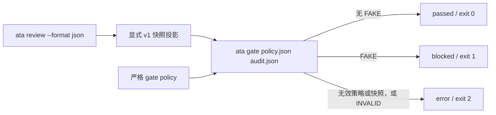

# v1.0 显式 opt-in 静态策略门禁设计

## 决策

v1.0 新增独立命令 `ata gate <policy.json> <audit.json>`。它将维护者提供的严格 version `1` 静态审计快照与显式门禁策略组合成一个紧凑、机器可读的门禁结果；只有配置了该策略的调用才会产生阻断退出码。

门禁只把确定性静态 `FAKE` 作为可阻断事实。`WEAK` 始终只是计数信息，绝不阻断；`UNASSESSED` 不是 `STRONG`，也不构成通过证据。输入快照中的 `INVALID` 表示静态输入无效，必须以错误退出码 `2` 结束，而不是被解释为通过或策略阻断。

`ata review` 继续拥有现有静态审计结果和 `0`/`1`/`2` 退出语义；`ata decision` 继续是有效输入必定退出 `0` 的建议性投影。v1.0 不修改两个命令的参数、输出或含义。

## 方案选择

采用独立门禁命令，而不是为 `ata review --policy` 增加阻断模式：v0.6 的 `--policy` 已是固定的建议性选择计数契约，混入门禁会使调用方无法区分分析与执行策略。也不把门禁隐藏在 GitHub Actions 示例中：本地、严格、可测试的 CLI 接口是 CI 集成的前提。

## 输入契约

### 门禁策略

`policy.json` 是严格 version `1` JSON 对象，顶层仅允许以下字段：

```json
{
  "version": "1",
  "id": "repository-static-fake-gate",
  "mode": "gate",
  "blockOn": ["FAKE"]
}
```

规则如下：

- `version` 必须为字符串 `"1"`；`id` 必须是非空字符串；`mode` 必须精确为 `"gate"`。
- `blockOn` 必须是恰好包含一次 `"FAKE"` 的数组。`WEAK`、`INVALID`、`STRONG`、`UNASSESSED`、空数组、重复值及未知值均为无效策略。
- 未读取环境变量、默认配置或发现式配置文件；只有显式传入的路径启用门禁。
- 不复用或改变 `ata review --policy` 的 `mode: "advisory"` 格式；两种策略代表不同职责。

### 静态审计快照

`audit.json` 使用既有 `ata decision` 严格 version `1` 信封：顶层只允许 `version` 与 `audit`；`audit` 只允许 `tests`、`findings`、`summary` 和可选的最小 `policy`/`baseline` 上下文。

快照由 CI 或调用脚本从 `ata review --format json` 显式投影而来。`semantic`、`mutation`、`diagnostics`、`selection`、任意未知字段以及不一致的 summary 均拒绝。解析时继续根据测试回调行范围关联 finding，并重算 summary、FTR 和 Trust Score；门禁本身只使用经过验证的 `summary.fake` 与 `summary.weak`/`summary.invalid`。

策略或快照无法读取、不是 JSON、字段未知、版本不支持或校验失败，均不输出部分结果并退出 `2`。

## 输出与退出语义

有效调用在标准输出写出以下严格 version `1` JSON，不包含源码、文件路径、测试名称、完整 findings、FTR 或 Trust Score：

```json
{
  "version": "1",
  "mode": "gate",
  "status": "blocked",
  "reasonCodes": ["STATIC_FAKE_FINDINGS"],
  "staticSummary": { "fake": 1, "weak": 0, "invalid": 0 },
  "policyId": "repository-static-fake-gate"
}
```

| 已验证快照状态 | `status` | reason code | CLI 退出码 |
| --- | --- | --- | --- |
| `invalid > 0` | 无结果 | `STATIC_INVALID_INPUT` 仅用于诊断文本 | `2` |
| `fake > 0` | `blocked` | `STATIC_FAKE_FINDINGS` | `1` |
| `fake = 0`，任意 `weak` | `passed` | `NO_STATIC_FAKE_FINDINGS`，并保留 weak 计数 | `0` |

`reasonCodes` 对 `blocked` 仅为 `STATIC_FAKE_FINDINGS`；对 `passed` 仅为 `NO_STATIC_FAKE_FINDINGS`。这避免把 `WEAK` 表述为阻断原因。无静态 `FAKE` 仅表示该快照未发现可阻断的确定性模式，绝不表示测试 `STRONG`、发布获批或质量保证。

## 组件与数据流



| 组件 | 职责 | 不可做的事 |
| --- | --- | --- |
| `src/core/gate-policy.ts` | 解析并加载严格的门禁策略，抛出 `GatePolicyError`。 | 不修改 advisory policy，不读取环境变量。 |
| `src/core/gate.ts` | 加载既有严格快照、根据 `FAKE` 生成 `GateResult`，处理 `INVALID`。 | 不重新审计、不执行源码、不消费 semantic/mutation。 |
| `src/core/types.ts` | 定义 `GatePolicy`、`GateResult`、稳定状态和原因码类型。 | 不变更 `AuditResult` 或 advisory decision 合约。 |
| `src/cli.ts` | 注册 `ata gate <policy> <audit>`，写 JSON，映射 `0`/`1`/`2`。 | 不改动 `review` 和 `decision`。 |
| `.github/` 示例 | 增加显式 opt-in gate 工作流或步骤，保留 v0.9 建议性示例。 | 不加 API、token、注释、注解或默认门禁。 |

## CI 集成

新增单独命名的 GitHub Actions 示例，触发条件、最小权限、全历史 checkout、Node 20 与本地构建方式沿用 v0.9 参考工作流。它必须显式指定仓库内的 gate policy 路径。工作流必须暂时关闭 shell 的 fail-fast，运行 `review` 并保存其退出码和静态 JSON：审计退出 `0` 或 `1` 时才用只允许字段的脚本生成 v1 快照并运行 `ata gate`；审计退出 `2` 或任何其他退出码时立即失败，不生成或调用门禁。最终必须原样返回 `ata gate` 的 `0`、`1` 或 `2`，使 `FAKE` 的静态审计不会在到达显式门禁前被 shell 提前终止。

示例不得替换现有 `ci.yml` 或 v0.9 `audit-reference.yml`，不得创建 PR 评论/检查注释、调用 GitHub API、读取凭据、执行被审计源码，且不把建议性 `decision` 的 recommendation 当作门禁输入。

## 测试与文档

每个行为遵循 RED-GREEN-REFACTOR：先加入聚焦测试并观察其因缺少模块/命令/标记而失败，再写最小实现并重新运行测试。

最少覆盖：

1. 仅接受严格 `FAKE` block policy，拒绝 `WEAK`、混合分类、重复、未知字段和缺失字段；
2. 合法 `FAKE` 快照输出 `blocked`/`1`；仅 `WEAK` 与无 finding 快照输出 `passed`/`0`；
3. `INVALID` 快照、无效策略及无效快照输出无部分 JSON 并退出 `2`；
4. gate 输出不泄漏 source/path/findings/FTR/Trust Score，且 policy ID 是唯一策略上下文；
5. `review` 与 `decision` 的既有退出码和输出不变；
6. CI 示例显式 opt-in、捕获 `review` 的 `0`/`1` 并继续到严格投影、对 `2` 立即失败、保留最小权限并转发 gate 的 `0`/`1`/`2`；
7. 英文优先、中文同步的 README、requirements、architecture、roadmap、rules、Skill、prompts、examples、evals 与实现记录契约标记；
8. 完整项目验证：`npm test`、`npm run lint`、`npm run typecheck`、`npm run format:check`、`npm run build`、`node dist/cli.js review benchmarks --format json` 以及 `git diff --check`。

## 非目标

v1.0 不新增静态规则、不执行测试或 reviewed source、不验证运行时结果、覆盖率或产品行为、不运行变异命令、不调用模型或网络服务、不读取凭据、不改变静态 finding/classification/summary/FTR/Trust Score、不增加豁免、发布批准或默认门禁，也不把未标记测试升级为 `STRONG`。
